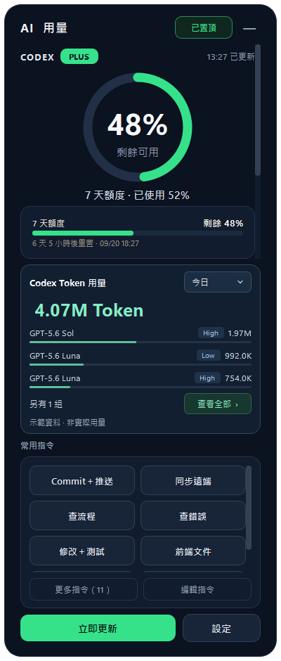
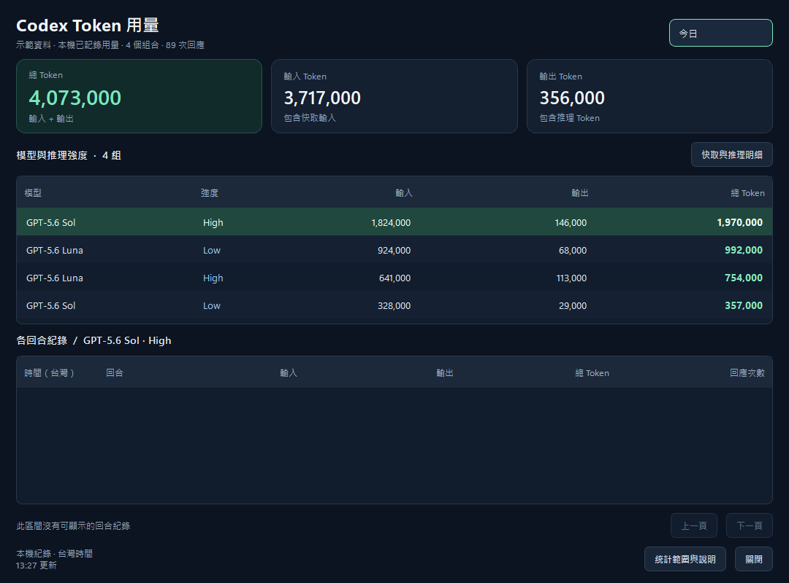
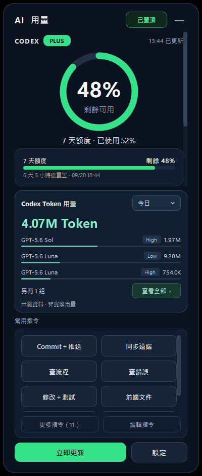

# Quota PromptDock

Windows 桌面上的 AI 額度與常用指令小工具。查看 Codex／Claude Code 剩餘額度、依模型與推理強度追蹤 Codex 與 Claude Code 的本機 Token 用量，並將常用指令一鍵貼到目前使用的 AI 工具。

**目前正式版：v1.5.0** · Windows x64 · 繁體中文 · 不需安裝 Python

[下載最新版本](https://github.com/and910805/QuotaDock/releases/latest) · [更新說明](https://github.com/and910805/QuotaDock/releases) · [驗證紀錄](驗證紀錄.md)



## 主要功能

| 功能 | 說明 |
|---|---|
| 額度資訊 | Codex／Claude Code 的已用與剩餘百分比、進度條、重置時間 |
| Token 用量 | Codex 與 Claude Code 各一張卡，依模型 × 推理強度彙總，支援日期篩選與各回合明細 |
| 常用指令 | 內建 11 個指令，可新增、編輯、排序及一鍵貼上 |
| 數字動畫 | 統計數值改變時播放 Odometer 數字滾動動畫 |
| 桌面操作 | 視窗置頂、系統匣、側邊懸浮圖示、額度提醒與開機啟動 |
| 顯示設定 | 75%～150% 縮放、Token 區塊顯示／隱藏、小視窗捲動 |

## 下載與開始使用

1. 前往 [最新正式版本](https://github.com/and910805/QuotaDock/releases/latest)，下載 **`QuotaDock-Windows-x64.exe`**。
2. 雙擊執行。若舊版正在執行，先從系統匣選單結束舊版；重複啟動只會喚醒原本的程式。
3. 額度查詢沿用可用且已登入的 Codex／Claude Code 本機環境，不需要在本工具填寫 API Key。首次啟動會在背景整理可核對的 Codex 歷史 Token 紀錄。
4. 使用常用指令時，先點一下 Codex、記事本或瀏覽器的輸入框，再點小工具的指令按鈕。程式會複製文字並嘗試切回原視窗貼上，**不會按 Enter 或自動送出**。
5. 若 Windows 限制切換視窗或貼上，回到輸入框按 `Ctrl＋V` 即可。未安裝或未登入 Codex，也能使用常用指令。

一般雙擊為免安裝執行。需要安裝到使用者程式目錄並建立桌面捷徑時，可在執行檔所在資料夾執行：

```powershell
.\QuotaDock-Windows-x64.exe --install
```

安裝位置為 `%LOCALAPPDATA%\Programs\QuotaDock\QuotaDock.exe`。升級會沿用既有設定、常用指令及 Token 資料庫。

## 額度與主畫面

畫面順序為 **額度資訊（含 Claude Token 用量）→ Codex Token 用量 → 常用指令 → 底部操作**。

- **額度**顯示帳號已用／剩餘百分比，不等於累計 Token。主圓環可在設定選擇自動、5 小時或 7 天額度；重置時間使用台灣時間。
- 額度在啟動、展開與按下「立即更新」時查詢；全新設定預設每 60 秒更新，可自行調整。查詢失敗會保留本次執行中最後成功的數值並標示狀態，沒有資料時顯示「尚無資料」。
- Codex 透過本機 App Server 的 `account/rateLimits/read` 查詢；Claude Code 的額度卡片位於 Codex 下方。
- 視窗會依內容與螢幕高度調整。正常版面保留圓環在上、額度卡片在下；空間不足時會縮小摘要或使用捲動區，常用指令與底部操作仍可使用。
- 可拖曳頂部移動視窗；右上角「—」可收合為側邊懸浮圖示，系統匣選單可顯示或結束程式。

## Token 用量（Codex 與 Claude Code）

這個區塊回答的是「哪些模型與推理強度用了多少 Token」，例如 Luna Low、Sol High、Fable Xhigh。清單來自實際紀錄，**沒有寫死模型或強度選項**；只要有可核對的本機紀錄，已使用過的舊模型或未來模型也能納入，不同版本分開統計。

Codex Token 卡位於主畫面中段；**Claude Token 卡在額度捲動區內、Claude Code 額度卡下方**，操作方式與 Codex 卡相同，日期區間各自記住。

| 操作 | 顯示內容 |
|---|---|
| 今日／近 7 天／本月／全部 | 依台灣時間篩選；近 7 天包含今天及前 6 個日曆日，預設今日並記住選擇 |
| 主畫面摘要 | 區間總量、用量最高的 3 個模型 × 強度組合，以及占區間總量的比例條 |
| 另有 N 組 | 總量仍包含全部組合；小螢幕可能減少摘要列數 |
| 查看全部 | 總量、輸入、輸出卡片及所有模型／強度組合，數字使用完整千分位格式 |
| 快取與推理明細 | 展開快取輸入、快取寫入與推理 Token 欄位 |
| 選取模型列 | 查看該組合的各回合時間、用量及回應次數，每頁 100 回合 |
| 統計範圍與說明 | 查看涵蓋日期、未納入紀錄及異常原因 |

<details>
<summary>查看明細視窗示範</summary>



</details>

### 收錄方式與計算規則

- Codex：讀取 `CODEX_HOME` 指定的目錄；未設定時使用使用者的 `.codex`，涵蓋 `sessions` 與 `archived_sessions`。
- Claude Code：讀取 `CLAUDE_CONFIG_DIR` 指定的目錄；未設定時使用使用者的 `.claude`，涵蓋 `projects` 下所有工作區與子代理逐字稿。以訊息 ID 去重——同一則訊息拆成多行、resume／fork 複製到新檔，以及子代理逐字稿邊生成邊重複的快照（取總量最大者）都只計一次。快取讀取與快取寫入計入輸入 Token，思考（thinking）計入輸出 Token。
- 首次在背景逐行、分批整理歷史。運行中每 10 秒讀取新增內容，每 60 秒尋找新檔案；「立即更新」也會觸發檢查。
- 使用 `token_usage_record.usage` 的逐次回應用量，以 `response_id` 去重，並透過回合 UUID 對應當時記錄的模型與推理強度。一個回合有多次回應時會全部累計。
- **快取輸入已包含在輸入 Token，推理已包含在輸出 Token**，不再次加進總量；也不將逐次用量與回合／對話累計相加。
- 隱藏區塊仍會背景收錄。App 關閉期間 Codex 留下的紀錄，下次啟動時補入；重新掃描、封存搬移或 fork 的相同回應不重複加總。
- 已收錄的統計保存在 SQLite，不因來源紀錄被刪除而消失。

### 統計範圍與缺漏

這是 **「本機已記錄用量」**，不等於所有裝置或整個帳號的用量，不換算訂閱額度百分比或費用。目前不包含跨裝置同步。

- 只有舊版 `token_count` 累計事件的紀錄不回推、不納入逐次總量。
- 缺少模型／強度、設定衝突或可辨識但無法歸屬的模型轉送，列為未知分類。未記錄的服務端轉送無法保證辨識。
- 同一回應 ID 的用量互相衝突時，排除該回應並標示。缺少必要用量、格式損壞或過大的紀錄行不當成零。
- `—` 表示缺少可核對資料或完整明細，不是零。來源格式變動、暫時鎖定或讀取失敗時保留已有統計並顯示狀態。

## Odometer 數字滾動動畫

v1.4.3 為會變動的統計數值加入約半秒的滾動動畫：

- 額度圓環、側邊懸浮圖示與 Codex／Claude 的百分比。
- Token 摘要、輸入／輸出／總量卡片與模型、回合表格中的用量。
- 組合數、回應／回合數、匯入進度、頁數、常用指令數與重置倒數。

日期、更新時間、版本號、模型名稱和回合 ID 保持靜態。相同數值不重播，首次取得數值不從虛構的零開始，隱藏介面停止動畫。動畫只改變呈現方式，實際統計與可存取文字保留精確目標值，並遵循 Windows 關閉視窗動畫的偏好。

<details>
<summary>播放數字動畫示範（示範資料）</summary>



</details>

## 常用指令

全新設定內建 11 個指令，既有自訂清單會保留：

| 按鈕 | 用途 |
|---|---|
| Commit＋推送 | 說明修改原因、內容、影響與測試，再推送遠端 |
| 同步遠端 | 確認分支、保留本機修改並同步 |
| 查流程 | 找入口、呼叫順序與相關檔案 |
| 查錯誤 | 找根因並提出修正 |
| 修改＋測試 | 完成修改與必要驗證 |
| 前端文件 | 整理欄位、API 與前端串接流程 |
| 查表／SQL | 釐清資料表關聯與查詢 |
| 白話說明 | 使用繁體中文與簡單例子解釋 |
| README | 更新用途、設定、操作與疑難排解 |
| 週報 | 整理成果、原因、影響與待辦 |
| 邏輯審查 | 尋找邊界條件與實際錯誤 |

「更多指令」可展開全部；「編輯指令」可新增、修改、刪除與排序，最後按「儲存變更」。儲存失敗會保留草稿與順序，排除問題後可重試。

按鈕只負責貼上文字；Commit、推送等工作仍由你在目標 AI 工具送出指令後執行。

## 設定與自動更新

「設定」可調整更新頻率、提醒、額度來源、開機啟動及顯示偏好。

- **顯示 Token 用量**：預設開啟，儲存後立即生效；隱藏仍會收錄。
- **介面縮放**：75%、90%、100%、110%、125%、150%，預設 100%。改變比例後會重新開啟並記住選擇，效果會疊加 Windows 縮放。
- **檢查新版本（連線 GitHub）**：預設開啟。執行檔啟動約 5 秒後查一次，持續開著則每 24 小時再查；原始碼與展示模式不執行版本檢查。

版本檢查同時讀取 [and910805/QuotaDock](https://github.com/and910805/QuotaDock/releases/latest) 與 [Andy61490963/Quota-PromptDock](https://github.com/Andy61490963/Quota-PromptDock/releases/latest) 的最新正式 Release，取版本較新者；版本號必須比目前版本高，且附有名稱完全相同的 `QuotaDock-Windows-x64.exe`，下載網址也必須指回該 Release 本身。單一來源查詢失敗不影響另一邊。草稿、預發行及只有程式碼變動的版本不會提示更新。

偵測到新版後會顯示「有新版 · 點此更新」。**由你點擊後才下載與安裝**：下載至暫存目錄、結束舊程式、替換安裝位置的執行檔，再重新開啟。既有設定、指令與 Token 資料庫沿用原位置。

**主畫面的「立即更新」更新的是額度與 Token 資料，不是檢查 App 新版。**

## 資料位置與備份

| 資料 | 位置 |
|---|---|
| 常用指令 | `%LOCALAPPDATA%\CodexUsageWidget\prompts.json` |
| 上一次指令備份 | 同目錄的 `prompts.json.bak` |
| Codex Token 統計 | `%LOCALAPPDATA%\CodexUsageWidget\token_usage.sqlite3` |
| Claude Token 統計 | `%LOCALAPPDATA%\CodexUsageWidget\claude_token_usage.sqlite3` |
| 額度快取 | `%LOCALAPPDATA%\CodexUsageWidget` 內的快取檔 |
| 設定 | Windows 登錄檔 `HKEY_CURRENT_USER\Software\EricTools\CodexUsageWidget` |

設定 `QUOTA_PROMPTDOCK_DATA_DIR` 可替換本機資料目錄；一般模式的設定仍使用上述 Windows 設定位置。備份 SQLite 前先從系統匣結束程式，若同目錄仍有 `token_usage.sqlite3-wal`／`-shm`，需一併保存。

Token 資料庫只保存統計數字、模型／強度、時間與紀錄識別及讀取進度，不另存提示詞、回答內容或登入憑證，也不將 Token 紀錄上傳。常用指令會寫入本機檔案及剪貼簿，並貼到你選擇的工具。開啟版本檢查時會連線 GitHub。

## 常見問題

| 情況 | 處理方式 |
|---|---|
| 額度顯示尚無資料或同步失敗 | 確認對應工具已安裝、登入且可連線，再按「立即更新」；常用指令仍可使用 |
| Token 顯示統計不完整 | 開啟明細的「統計範圍與說明」，查看舊格式、缺漏、衝突或損壞來源的原因 |
| 使用過模型卻沒出現在清單 | 確認日期區間與本機來源；只有累計事件或不在本機的紀錄不會推算補入 |
| 看不到數字動畫 | 需有數值變化才播放；首次載入、相同值、隱藏介面或 Windows 關閉動畫時不會播放 |
| 常用指令貼上失敗 | 回到目標輸入框按 `Ctrl＋V`；文字已複製至剪貼簿 |
| 放大後內容超出視窗 | 捲動額度區或指令區，或在設定降低介面縮放比例 |
| 執行新版卻仍看到舊畫面 | 先從系統匣結束原本的執行個體，再開新版 |
| 沒收到新版提示 | 確認版本檢查已開啟、網路可連到 GitHub，且正式 Release 比目前版本新；查詢失敗時不會跳出錯誤提示 |

## 開發與測試

使用 Python／PySide6 開發；正式打包環境為 Windows x64、Python 3.13，依賴版本固定於 [`requirements-lock.txt`](requirements-lock.txt)。

```powershell
py -3.13 -m venv .venv
.\.venv\Scripts\python.exe -m pip install -r requirements-lock.txt
.\.venv\Scripts\python.exe app.py
```

展示模式使用明確標示的示範數字，不讀寫 Token 資料庫：

```powershell
.\.venv\Scripts\python.exe app.py --demo
```

執行測試與打包：

```powershell
$env:QT_QPA_PLATFORM = "offscreen"
.\.venv\Scripts\python.exe -m pytest -q
Remove-Item Env:QT_QPA_PLATFORM
.\build_release.ps1
```

打包腳本會先執行測試，再產生 `release/QuotaDock.exe`。目前共 **139 項自動化測試**，發布時由 [GitHub Windows 打包流程](https://github.com/and910805/QuotaDock/actions)重跑；另完成 27 項原生動畫／Token 介面測試及 75%～150% Qt 縮放渲染。測試使用隔離資料與替身；跨程式貼上及實際 Windows DPI／多螢幕操作的驗證範圍見 [驗證紀錄](驗證紀錄.md)。

| 檔案 | 職責 |
|---|---|
| `app.py` | 額度查詢、主視窗、設定、通知與版本更新 |
| `token_usage.py` | Codex 紀錄讀取、SQLite 儲存及彙總查詢 |
| `claude_usage.py` | Claude Code 紀錄讀取與去重（沿用同一套儲存） |
| `token_panel.py` | Token 背景服務、摘要與明細視窗（Codex 與 Claude 共用） |
| `odometer.py` | 數字滾動、動畫狀態與表格數值呈現 |
| `prompt_tools.py` | 常用指令保存、編輯與原生貼上 |

### 發布新版本

更新 `APP_VERSION` 並通過測試後，提交程式碼、建立對應的 `v*` 標籤並推送。預設分支為 `mainer`，發布流程在 [`.github/workflows/release.yml`](.github/workflows/release.yml)。

GitHub Actions 會安裝固定依賴、測試、打包，並上傳 `QuotaDock-Windows-x64.exe`。若已有草稿 Release，執行檔會上傳至草稿，仍需檢查後手動公開；若沒有 Release，流程會建立正式版。工作流程也支援手動執行，但必須選擇 `v*` 標籤。

正式公開前確認版本號、發布說明、執行檔與下載測試，並附上原始碼、第三方授權及校驗碼。

## 授權

本專案延續 [and910805/QuotaDock](https://github.com/and910805/QuotaDock)，使用 [MIT 授權](LICENSE)。Qt／PySide6 等第三方元件的授權與元件清單見 [`licenses/`](licenses/)，正式 Release 另附授權壓縮檔。介面設計規範見 [DESIGN.md](DESIGN.md)。
