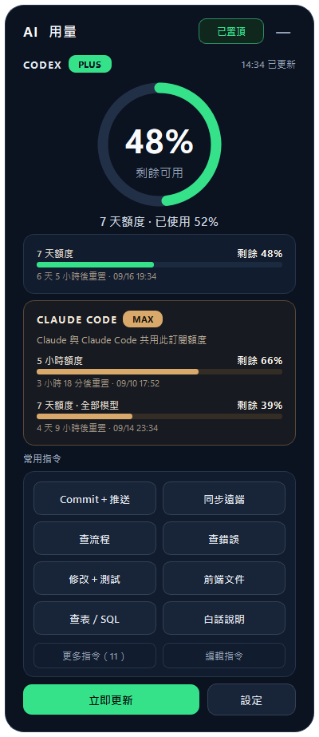

# Quota PromptDock

沿用 [Andy61490963/Quota-PromptDock](https://github.com/Andy61490963/Quota-PromptDock) 的 Windows 額度小工具，新增常用指令與一鍵貼上。保留深色面板、綠色圓環、Claude Code、系統匣、通知和側邊收合。



## 開始使用

1. 解壓免安裝包，雙擊 `QuotaDock.exe`。不需要另外安裝 Python。
2. 先點一下 Codex、記事本或瀏覽器的輸入框，再點小工具的指令按鈕。
3. 小工具會複製完整文字、切回前一個視窗，執行 Ctrl＋V；不會按 Enter 或自動送出。
4. 若視窗切換或貼上受 Windows 限制，回到輸入框按 Ctrl＋V。
5. 「更多指令」顯示全部；「編輯指令」可新增、修改、刪除與上下移動，最後按「儲存變更」。儲存失敗時視窗與編輯內容會保留，排除檔案權限問題後可直接重試。其他操作結果以短暫提示顯示。

小螢幕會縮小額度摘要，8 個常用指令及「立即更新／設定」保持可見。滑鼠移至上方額度區可捲動查看 Claude 完整內容；點「更多指令」後可在指令區捲動其餘按鈕。

視窗高度會隨內容自動收緊。Claude 未安裝或卡片內容較少時，常用指令緊接在下方，不保留大片空白；視窗底部位置維持不變。

要讓文字、按鈕與整個介面一起放大或縮小，開啟「設定 → 介面縮放」，選擇 75%、90%、100%、110%、125% 或 150%，再按「儲存並套用」。變更比例後會重新開啟小工具並記住選擇；100% 為預設。此比例會疊加 Windows 本身的縮放，大比例下空間不足時可捲動額度、指令及設定內容，底部儲存按鈕保持可見。

首次開啟預設在右下角。可拖曳頂部調整位置，按右上角收合成圓形圖示。系統匣選單可顯示或結束程式；重複啟動會叫出既有視窗。首次使用預設手動啟動，設定內可開啟登入 Windows 時自動啟動。

## 內建 11 個常用指令

| 按鈕 | 用途 |
|---|---|
| Commit＋推送 | 說明為什麼修改、改動內容、影響與測試，再推送遠端 |
| 同步遠端 | 確認分支、保留本機修改並同步 |
| 查流程 | 找入口、呼叫順序與相關檔案 |
| 查錯誤 | 找根因並提出最小修正 |
| 修改＋測試 | 完成修改與必要驗證 |
| 前端文件 | 整理欄位、API 與前端串接流程 |
| 查表／SQL | 釐清資料表關聯與查詢 |
| 白話說明 | 使用繁體中文與簡單例子解釋 |
| README | 更新用途、設定、操作與疑難排解 |
| 週報 | 整理成果、原因、影響與待辦 |
| 邏輯審查 | 尋找邊界條件與實際錯誤 |

這些按鈕只是貼上文字。涉及 Commit、推送等動作，仍需你在目標 AI 工具確認並送出指令。

## 額度

顯示帳號已用／剩餘百分比，**不是累計 Token 數量**。上方圓環保留原有最低剩餘額度邏輯，可在設定調整。重置時間固定使用台灣時間。

啟動、展開及「立即更新」都會查詢。全新設定預設每 60 秒更新，既有更新頻率仍保留。失敗會保留本次執行中最後成功的資料並標示；沒有資料則顯示「尚無資料」。Codex 未安裝或未登入不影響常用指令。

Codex 使用官方本機 App Server 的 `account/rateLimits/read`，沿用目前登入環境，不需要填寫 API Key。Claude Code 沿用原專案的卡片，直接顯示在 Codex 額度下方；常用指令接在後面。

## 資料與設定

- 指令：`%LOCALAPPDATA%\CodexUsageWidget\prompts.json`；再次保存時備份前一版為 `prompts.json.bak`。
- 原專案設定繼續使用 Windows 的 Qt 設定儲存，保留既有偏好；用量快取也沿用原位置。
- 指令不會傳到小工具的伺服器；程式沒有自己的伺服器。點擊後文字會進入 Windows 剪貼簿及你選擇的目標程式。
- 自動更新只檢查本專案的 GitHub Release；點選安裝更新才會安裝到使用者程式目錄。一般雙擊保持免安裝。
- 如需明確安裝與桌面捷徑，可執行 `QuotaDock.exe --install`。原有開機啟動偏好會保留。

## 從原始碼執行

需要 Windows x64、Python 3.12 以上。建議在專案內建立虛擬環境：

```powershell
py -3 -m venv .venv
.\.venv\Scripts\python.exe -m pip install -r requirements-lock.txt
.\.venv\Scripts\python.exe app.py
```

打包執行 `.\build_release.ps1`，會先執行全部測試，再產生 `release/QuotaDock.exe`。測試使用隔離的資料夾與替身，不會把文字貼到使用者的其他視窗。

依指定安裝設計 Skill：

```powershell
npx ui-ux-pro-max-cli init --ai codex
npx skills add aa-on-ai/agentic-design-system --agent codex --copy --yes
```

設計規範見 [DESIGN.md](DESIGN.md)，驗證狀態見 [驗證紀錄.md](驗證紀錄.md)。原始碼的測試包含 Qt 元件操作；實際跨程式貼上及實機縮放仍需在可操作的 Windows 桌面完成驗收。

## 授權

本專案延續 [and910805/QuotaDock](https://github.com/and910805/QuotaDock) 與指定分支，保留原 [MIT 授權](LICENSE)。Qt／PySide6 為第三方元件，發行包附對應授權文字與元件清單。
