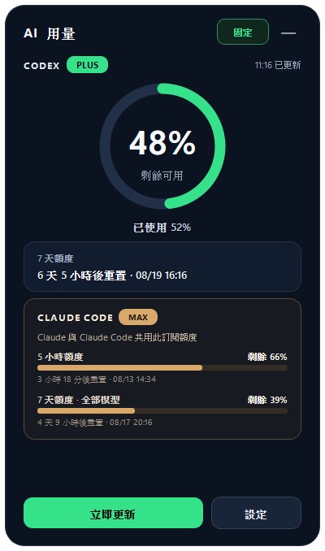

# QuotaDock

一個常駐在 Windows 桌面側邊的 AI 程式開發工具額度監控器，目前支援 **OpenAI Codex** 與 **Claude Code**。



## 功能

- 同時顯示 Codex 與 Claude Code 的剩餘額度及重置倒數
- 縮小後變成螢幕側邊懸浮圓環，可拖曳換邊、點擊展開
- 額度每下降 5% 顯示提醒
- 新週期重置為 100% 時顯示提醒
- 提醒泡泡預設停留 15 秒，可改成 5、10、15 或 30 秒
- 定時自動更新、開機自動啟動與系統匣操作
- 資料只保留在本機，不會上傳提示詞、程式碼或登入憑證


## 安裝方式

### 方法一：從 Releases 直接安裝（推薦）

1. 前往 [Releases](https://github.com/and910805/QuotaDock/releases/latest)。
2. 下載 `QuotaDock-Windows-x64.exe`。
3. 執行下載的 EXE；QuotaDock 會在桌面建立捷徑並設定開機自動啟動。

這是尚未購買程式碼簽章憑證的開源程式。若 Windows SmartScreen 顯示警告，請先確認下載網址確實來自本儲存庫，再選擇「其他資訊」→「仍要執行」。

### 方法二：從原始碼安裝

需求：Windows 10/11、[Python 3.11 或更新版本](https://www.python.org/downloads/windows/)，以及已登入的 Codex 或 Claude Code CLI。

1. 在 GitHub 按 **Code → Download ZIP** 並解壓縮；也可以使用：

   ```powershell
   git clone https://github.com/and910805/QuotaDock.git
   ```

2. 雙擊專案資料夾裡的 `install.bat`。
3. 安裝程式會建立獨立 Python 環境、安裝相依套件、執行測試、產生 EXE，最後建立桌面捷徑。

## 使用說明

- 按右上角的「—」會縮成側邊懸浮圖示。
- 點一下懸浮圖示即可展開；拖曳後放開會自動貼齊最近的螢幕邊緣。
- 在懸浮圖示按右鍵，可立即更新、開啟設定或結束程式。
- 「設定」可以調整更新頻率、5% 提醒、提醒停留秒數與開機啟動。

### Claude Code 額度顯示「未登入」

QuotaDock 會尋找 PATH、npm 安裝目錄，以及 Claude 桌面版管理的 CLI。若仍顯示未登入，請在終端機執行：

```powershell
claude login
```

完成後回到 QuotaDock 按「立即更新」。只登入 Claude 桌面版不一定會建立 Claude Code CLI 所需的憑證。

## 從原始碼開發

```powershell
python -m venv .venv
.\.venv\Scripts\Activate.ps1
python -m pip install -r requirements.txt
python -m pytest -q
python app.py
```

建立 Windows EXE：

```powershell
.\build_release.ps1
```

## 隱私與相容性

QuotaDock 透過 Codex 與 Claude Code 各自的本機服務取得用量資訊，不會讀取或保存登入憑證，也沒有遙測或分析服務。這是非官方開源工具；服務商更新本機介面後，讀取方式可能需要跟著調整。

## 授權

[MIT License](LICENSE)
